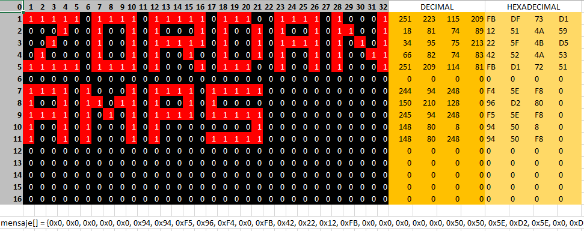
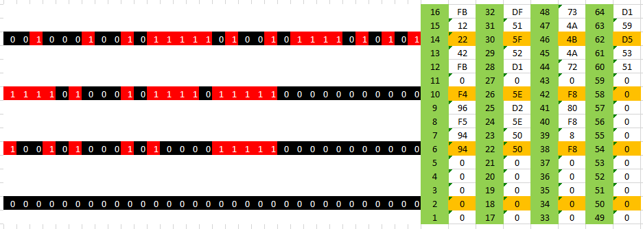
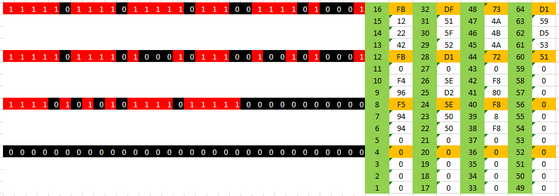
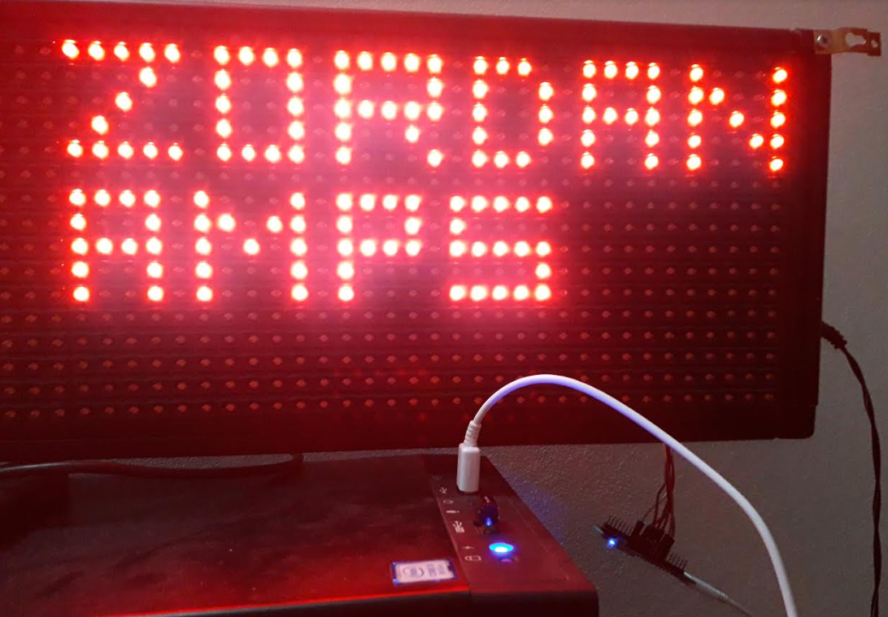

# p10hub12
Muestra un mensaje en una pantalla led de 16x32 P10 con protocolo HUB12 (arduino)

El mensaje se construye mapeando cada bit (equivalente a un led) y luego cada byte como un elemento de un array mensaje[].

Los bytes se envían en el orden que figuran en las columnas de color verde de las siguientes imagenes.
La pantalla utiliza integrados 74HC595 los cuales reciben un byte en forma serial y lo sacan en paralelo pudiendo controlar 8 leds.
Tiene 16 de estos chips con los cual 16 x 8 bytes = 128 bits es decir 128 leds que puede controlar pero el panel tiene 512 leds.
El panel ademas tiene otro chip que se encarga de seleccionar que fila mostrar pudiendo elegir entre 4 filas de 128 leds que hacen al total de 512 leds. Los terminales A y B son para seleccionar estas 4 opciones.

Enviando el primer byte.
Se debe enviar por el terminal DATA cada bit comenzando por el MSB. Por cada estado de DATA se debe generar un pulso en CLK.
Para la primer fila A=0 B=0 fila=0 i=0 por lo tanto mensaje[0] = 0x0 (sería el primer byte del arreglo)

Enviando el segundo byte.
Para la primer fila A=0 B=0 fila=0 i=4 por lo tanto mensaje[4] = 0x0 (sería el quinto byte del arreglo)

Enviando el tercer byte.
Para la primer fila A=0 B=0 fila=0 i=8 por lo tanto mensaje[8] = 0x96 o en binario 10010110 (sería el noveno byte del arreglo)

Completando la primer fila.
A medida que el bucle "for" incrementa de a 4 bytes dentro del arreglo se va completando la primer fila.

Segunda fila completa.

Tercera fila completa.

Cuarta fila completa.

El resultado que se obtiene se puede observar en la siguiente imagen:

